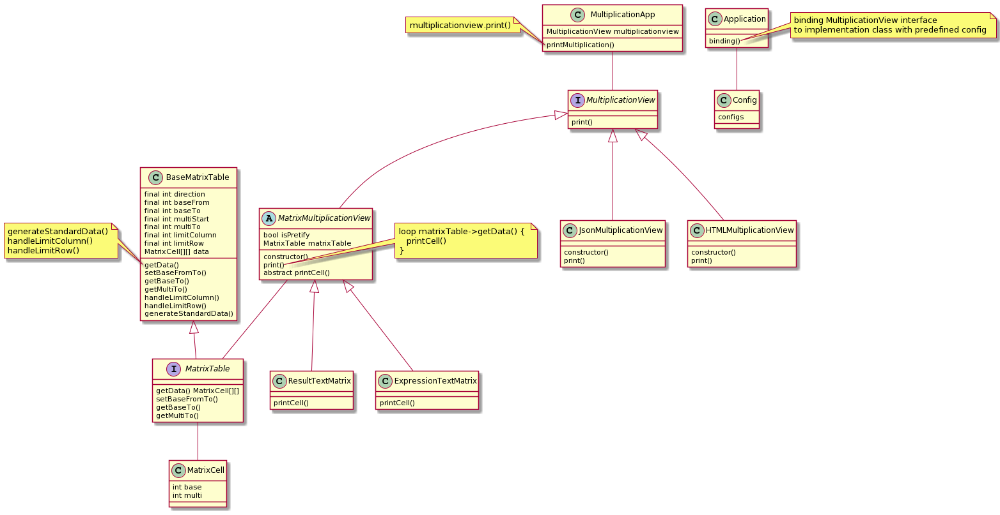

# Problem

```
1. Please create a program to visualize a multiplication table in:
 ⁃ Columns & Rows
 ⁃ Matrix
Example: N = 3 => print table in N columns
Output: 
————————————————————
// Column & Rows Table: 
2 * 1 = 2  3 * 1 = 3  4 * 1 = 4
2 * 2 = 4  3 * 2 = 6  4 * 2 = 8
2 * 3 = 6  3 * 3 = 9  4 * 3 = 12
…
2 * 10 = 20 3 * 10 = 30 4 * 10 = 40

5 * 1 = 5  6 * 1 = 6  7 * 1   = 7
5 * 2 = 10 6 * 2 = 12 7 * 12 = 14
… 
H
// Matrix Table
1 2 3 4 5 6 7 8 9 10
2 4 6 8 10 12 14 16 18 20
3 6 9 12 15 18 21 24 27 30
4 8 12 16 20 24 28 32 36 40
…
10 20 30 40 50 60 70 80 90 100

If we want to visualize the multiplication table in another type of view, how easy to add it to your program? For example
2 * 1 = 2  2 * 2 = 4  2 * 3 = 6  …
3 * 1 = 3  3 * 2 = 6  3 * 3 = 9  …
4 * 1 = 4  4 * 2 = 8  4 * 3 = 12 …
…
```

# Analyse
First we will analyse the feature of program.
Program has to display the view of multiplication table so we have `print` feature of a `MultiplicationView`.
Here we can print as text, or as json, or as html. Those class will be implementation of `print` feature.

Next we have to generate data to the view. Therefore we will have `getData` feature.
How the data was displayed will make the implementation of this feature different.

# Class Diagram
After a while, we will have a class diagram like below


# Technical Aspect
- Use `php-di` library to inject interface with implementation.

# Tools support
- Use PlantUML to write class diagram

# How to Run
- Install php ~7.4
- Run `composer install` to install library
- Run `php app.php` to render the multiplication table
- You can config later in config file the make more customize table

